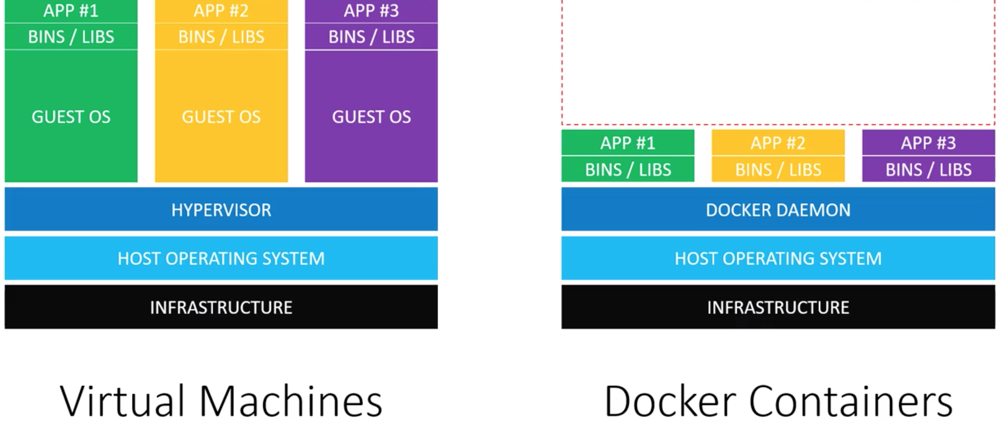
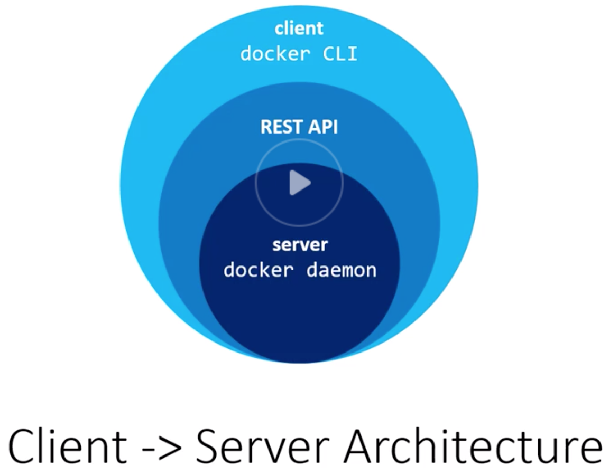

# Chapter 3: Understanding Docker

## 3.1. Virtual Machines vs Docker Containers
---------------------------------------------

- Docker containers are not VMs. Think of containers as isolated processes.
- To be able to run a VM on a server:
  - We need an infrastructure
  - Then a host operating system
  - Hypervisor to run VMs on this operating system. There are two types of hypervisors:
    - Type 1: Direct link to the infrastructure, such as HyperKit (OSx), Hyper-V (Windows) and KVM (Linux)
    - Type 2: Runs as an app on the host OS: VirtualBox/VMWare
  - On top of hypervisor, we will have different guest operating systems. The problem is all these guestOSs occupies space on our disk, uses CPU and memory resources.
  - On top of GuestOS, we will have our binaries and libraries.
  - Then there will be our apps on top of everything.

- To be able to run a docker container on a server:
  - We need an infrastructure
  - Then a host operating system
  - Docker deamon (replaces hypervisor)
  - Our binaries and libraries
  - Then there will be our apps on top of everything.

- In summary:

  

- Both have advantages and disadvantages.
- VMs are good for isolating systems.
- Docker containers are good for isolating applications.

### Analogy

- VMs are houses. Houses (VMs) are fully self-contained. They have their own infrastructure like plumbing, heating, electrical systems and so on. On the other hand, most houses include a bedroom, bathroom, living room and additional rooms. If you only need an area to sleep and poop, you will probably end up by buying what you need because that's how houses are built.

- Docker containers are apartments. Apartments also provide privacy, and you will have your space, but you will be using a shared infrastructure. Each apartment building is using shared plumbing, heating, electrical systems etc. Apartments maximize alternatives for your size needs, you can buy a huge apartment or a very small one.

## 3.2. VMs vs. Docker containers in the real world!
----------------------------------------------------

- Cloud hosting providers use VMs. Hardware constraints tied into your plan.

- Docker can run on dedicated hardware (bare-matel) too!

- Build once deploy everywhere is the whole point.

## 3.3. Visualizing Docker's architecture
-----------------------------------------

- `docker daemon` is the server that runs on host operating system. It only runs on Linux, because it depends on Linux kernel features.

- `docker daemon` exposes a REST API for the clients. One of the most popular clients communicating with daemon is `docker cli`. When you install docker, you get daemon and cli together.

  

- You can use the client to manage many components of docker, like containers, images and networks.

  
