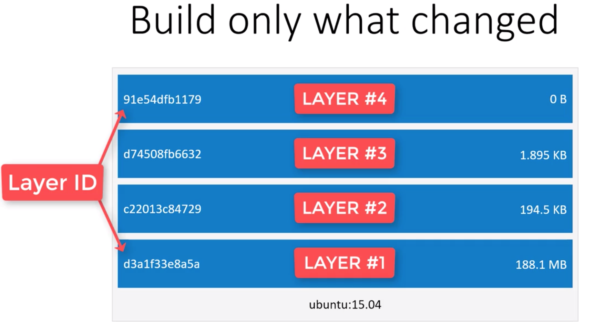

# Chapter 5: Discovering Docker

## 5.1. Hello world with Docker
-------------------------------

```bash
docker run hello-world
# => hello world!
```

To generate this message, Docker took the following steps:

1. The Docker client contacted the Docker daemon.
2. The Docker daemon pulled the "hello-world" image from the Docker Hub (amd64)
3. The Docker daemon created a new container from that image which runs the executable that produces the output you are currently reading.
4. The Docker daemon streamed that output to the Docker client, which sent it to your terminal.

Lets play a little bit:

```bash
docker run -it ubuntu bash
docker run -it alpine sh
docker run -it alpine ls /var
```

## 5.2. Docker Images and Containers
------------------------------------

A docker image is a combination of a file system and parameters. A docker image doesn't have any state attached to it, and once built it never changes. A docker image is something that you can download, build and run.

Container is the running version of an image. Analogy:

  - Docker Image = Class
  - Container = instance

You can run many containers from a single image. Docker containers are immutable. Any change you made will be lost forever.

```bash
docker run -it alpine sh
cd /home
touch foobar.txt
exit # file is gone forever
```

- If we open two different terminals, and type `docker run -it alpine sh` in both of them, this two containers will be independent and will not effect each others. When you create a file in one of them, the other container will not be able to see it.

## 5.3. Downloading and Storing Docker Images
---------------------------------------------

- DockerHub is a docker registry. It's a place where you can store your images. It's like Github, but for docker images.

```bash
docker run docker.io/library/hello-world
```

## 5.4. Explaining the Docker Build Process
-------------------------------------------

There are 2 ways to build a docker image:

1. `docker commit` command.
2. Dockerfile

Most of the time we prefer to use Dockerfile. Docker images are composed one or more layers. Try to think of each layer as self contained files, and a docker image is the result of stacking together one or more of this layers.



Docker only pulls parts that has changed. So, when we update our docker image, it will not download everything from scratch, it will only download changed parts. The same exists when it comes to generating docker images.
