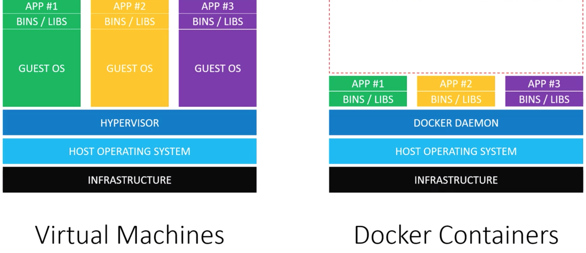
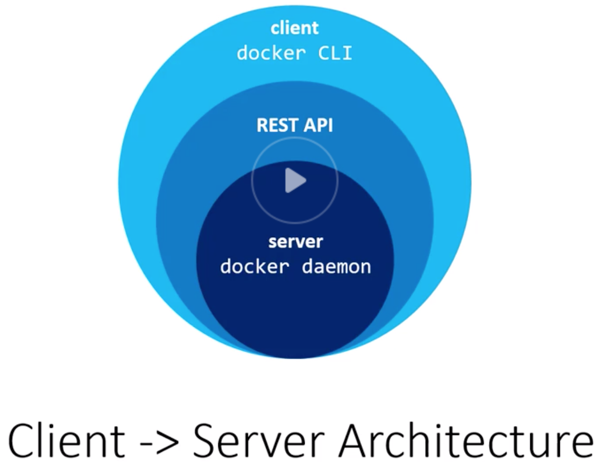
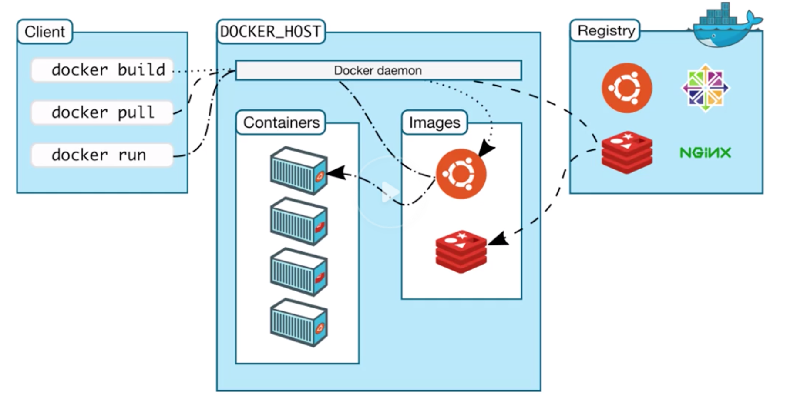
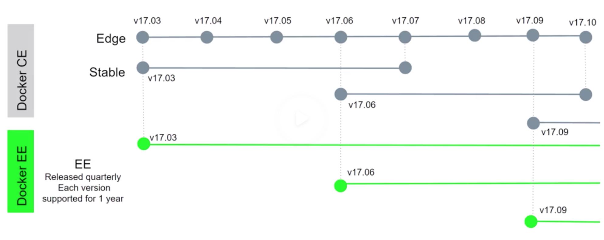

# Is Docker Right For You?

## Docker's biggest wins
-----------------------------

- Saving time and money.
- VMs waste lots of resources (like Vagrant).
- Each Vagrantbox is huge, around 700mb-1GB. So we need lots of spaces for each project.
- Docker is 10x efficient than Vagrant when it comes to disk space.
- Prevents 'it works on my machine' issues.
- Prevents problems like dependency version mismatch.
- Docker runs your apps in a controlled environment.
- Keeps your system nice and clean.
- Prevents setup burden of languages and tools.

## Docker vs Others
--------------------------------------

- VMs create isolated environments, but they are slow and not efficient.
- Then LXC came into the action. The problem with LXCs is, they are tough to use, because they are complicated.

# Understanding Docker

## Virtual Machines vs Docker Containers
---------------------------------------------

- Docker containers are not VMs. Think of containers as isolated processes.
- To be able to run a VM on a server:
  - We need an infrastructure
  - Then a host operating system
  - Hypervisor to run VMs on this operating system. There are two types of hypervisors:
    - Type 1: Direct link to the infrastructure, such as HyperKit (OSx), Hyper-V (Windows) and KVM (Linux)
    - Type 2: Runs as an app on the host OS: VirtualBox/VMWare
  - On top of hypervisor, we will have different guest operating systems. The problem is all these guestOSs occupies space on our disk, uses CPU and memory resources.
  - On top of GuestOS, we will have our binaries and libraries.
  - Then there will be our apps on top of everything.

- To be able to run a docker container on a server:
  - We need an infrastructure
  - Then a host operating system
  - Docker deamon (replaces hypervisor)
  - Our binaries and libraries
  - Then there will be our apps on top of everything.

- In summary:

  

- Both have advantages and disadvantages.
- VMs are good for isolating systems.
- Docker containers are good for isolating applications.

### Analogy

- VMs are like houses. Houses (VMs) are fully self-contained. They have their own infrastructure like plumbing, heating, electrical systems and so on. On the other hand, most houses include a bedroom, bathroom, living room and additional rooms. If you only need an area to sleep and poop, you will probably end up by buying what you need because that's how houses are built.

- Docker containers are apartments. Apartments also provide privacy, and you will have your space, but you will be using a shared infrastructure. Each apartment building is using shared plumbing, heating, electrical systems etc. Apartments maximize alternatives for your size needs, you can buy a huge apartment or a very small one.

## VMs vs. Docker containers in the real world!
----------------------------------------------------

- Cloud hosting providers use VMs. Hardware constraints tied into your plan.

- Docker can run on dedicated hardware (bare-matel) too!

- Build once deploy everywhere is the whole point.


## Visualizing Docker's architecture
-----------------------------------------

- `docker daemon` is the server that runs on host operating system. It only runs on Linux, because it depends on Linux kernel features.

- `docker daemon` exposes a REST API for the clients. One of the most popular clients communicating with daemon is `docker cli`. When you install docker, you get daemon and cli together.

  

- You can use the client to manage many components of docker, like containers, images and networks.

  

# Installing Docker

## Docker Community Edition vs. Docker EE
----------------------------------------------

- Docker CE is production ready. Docker EE is for mission critical apps.

- Docker EE provides:

  - Certified images and plugins
  - Vulnerability scans
  - Access to Docker datacenter
  - Official support

- Prices range 750$ to 2000$ per year.

- Docker CE edition comes with two release channels:

  - Edge channel: Released each month. Getting updates at the same month.
  - Stable channel: Released every 4 months. Each release is supported for 4 months.

- Docker EE releases are every 3 months. Each release is supported for 12 months.

  

- Versioning scheme is structured with date. For example `17.03` means 2017 March.

## Docker toolbox vs. Docker for Mac/Windows
-------------------------------------------------

Docker toolbox installs:
  - Docker CE/EE
  - Docker Compose
  - Docker Machine
  - VirtualBox
  - Docker QuickStart Terminal
  - Kitematic

Since the `docker-daemon` requires Linux, and OSx and Windows are not running Linux you need some way to load up Linux in OSx and Windows. Here VirtualBox comes into the action. Remember, VirtualBox is a type-2 hypervisor. `docker machine` helps you create servers and install docker. It's a command line tool. Docker machine can be used locally in cloud.

- Docker for Mac/Windows is a newer tool than Docker toolbox, and is the prefered way. No VirtualBox is required for Docker for Mac/Windows because it uses the type-1 hypervisor (OSx: Hyper-Kit, Windows: Hyper-V).

Docker for Mac/Windows installs:
  - Docker CE/EE
  - Docker Compose
  - Docker Machine

**Docker Toolbox vs. Docker for Mac/Windows**

- Docker Toolbox (with type2 hypervisor, virtualbox):
  - Requires Windows 7+ or Mountain Lion 10.8+, and Windows home version is ok.
  - Works on older hardware
  - Docker daemon is running on remote. Ie: access 192.168.99.100 etc.
  - You have to use `docker quick start terminal`.

- Docker for Mac/Windows (with type1 hypervisor, natively, without VirtualBox):
  - Requires Win 10 (Pro, Ent, Stu) or Yosemite 10.10.3+
  - Requires hardware never than 2010
  - Docker daemon is running locally. Ie. access localhost
  - You can use any terminal you want.

## Verifying you have Docker installed
-------------------------------------------

- Check docker:

  ```bash
  docker info
  ```

- Check docker-compose:

  ```bash
  docker-compose --version
  ```

# Discovering Docker

## Hello world with Docker
-------------------------------

```bash
docker run hello-world
# => hello world!
```

To generate this message, Docker took the following steps:

1. The Docker client contacted the Docker daemon.
2. The Docker daemon pulled the `hello-world` image from the Docker Hub (amd64)
3. The Docker daemon created a new container from that image which runs the executable that produces the output you are currently reading.
4. The Docker daemon streamed that output to the Docker client, which sent it to your terminal.

Lets play a little bit:

```bash
docker run -it ubuntu bash
docker run -it alpine sh
docker run -it alpine ls /var
```

## Docker Images and Containers
------------------------------------

A docker image is a combination of a file system and parameters. A docker image doesn't have any state attached to it, and once built it never changes. A docker image is something that you can download, build and run.

Container is the running version of an image. Analogy:

  - Docker Image = Class
  - Container = instance

You can run many containers from a single image. Docker containers are immutable. Any change you made will be lost forever.

```bash
docker run -it alpine sh
cd /home
touch foobar.txt
exit # file is gone forever
```

If we open two different terminals, and type `docker run -it alpine sh` in both of them, this two containers will be independent and will not effect each others. When you create a file in one of them, the other container will not be able to see it.

## Downloading and Storing Docker Images
---------------------------------------------

DockerHub is a docker registry. It's a place where you can store your images. It's like Github, but for docker images.

```bash
docker run docker.io/library/hello-world
```

## Explaining the Docker Build Process
-------------------------------------------

There are 2 ways to build a docker image:

1. `docker commit` command.
2. Dockerfile

Most of the time we prefer to use `Dockerfile`. Docker images are composed one or more layers. Try to think of each layer as self contained files, and a docker image is the result of stacking together one or more of this layers.


Docker only pulls parts that has changed. So, when we update our docker image, it will not download everything from scratch, it will only download changed parts. The same exists when it comes to generating docker images.

# Docker in the Real World

## Creating a Dockerfile
--------------------------------------

Docker images are basically stack of layers and Dockerfile is just a recipe.

The first instruction in a Dockerfile must be `FROM`. `FROM` allows us to import/define a base image. A base image could be another docker image, or we can create one from scratch. It's highly recommended to use an official image.

`RUN` allows you to run any command, that you can run on your OS, without docker.

`WORKDIR` expects you to pass a directory, and any other instruction we run from this point on will be on the context of the path we set here.

`COPY` simply copies files from the directory where your Dockerfile exists. You can't copy files that are above Dockerfile, you can only copy files that are below your Dockerfile.

Dockerfile after this chapter:

```Dockerfile
FROM ruby:2.5-alpine

RUN mkdir /app
WORKDIR /app

COPY Gemfile Gemfile.lock /app
RUN bundle install --jobs 4 --retry 3
COPY . .
```

Docker caches every layer. So it makes sense to copy `Gemfile` and `Gemfile.lock` before copying entire project folder. Otherwise if we configure our project like this:

```Dockerfile
FROM ruby:2.5-alpine

RUN mkdir /app
WORKDIR /app

COPY . .
RUN bundle install --jobs 4 --retry 3
```

It's going to install our dependencies every time from scratch and it's gonna take more time.

`LABEL` command enables you to attach arbitrary meta data to your image, that you can retrieve later.

```Dockerfile
LABEL maintainer="M. Serhat Dundar <msdundars@gmail.com>"
      version="0.1"
```

`CMD` is a little bit interesting. It defines the default command to be run when the docker image gets started. `CMD` is different than the `RUN` command, because it's executed when the docker image gets ran, as opposed to the `RUN` command, that is executed when the docker image gets built. We can use `CMD` to run the server when image gets run.

```Dockerfile
CMD bundle exec rails server -b "0.0.0.0" -p 3000
```

Dockerfile after this chapter:

```Dockerfile
FROM ruby:2.5-alpine

RUN mkdir /app
WORKDIR /app

COPY Gemfile Gemfile.lock /app/
RUN bundle install --jobs 4 --retry 3
COPY . .

LABEL maintainer="M. Serhat Dundar <msdundar@babbel.com>" \
  version="0.1"

CMD bundle exec rails server -b "0.0.0.0" -p 3000
```

## Building and pushing Docker images
------------------------------------------

Get help:

```bash
docker --help
```

Build the image:

```bash
docker image build -t deeplinks_resolver .
```

Inspect an image:

```bash
docker image inspect deeplinks_resolver
```

Build the image with a tag:

```bash
docker image build -t deeplinks_resolver:1.0 .
```

List all docker images on your computer:

```bash
docker image ls
```

Delete an image:

```bash
docker image rm deeplinks_resolver:1.0
```

> We can use repository, repository+tag and image ID options to delete an image.

We don't need to type full ID to delete an image, just some characters are fine:

```bash
docker image rm 1234
```

Login to Docker hub:

```bash
docker login
```

Before pushing our image to hub we must tag it with our username:

```bash
docker image tag deeplinks_resolver msdundar/deeplinks_resolver:latest
```

Push the latest version of the image:

```bash
docker image push msdundar/deeplinks_resolver:latest
```

Pull the image from docker hub:

```bash
docker pull msdundar/deeplinks_resolver
```

## Running Docker containers
---------------------------------

List all running containers:

```bash
docker container ls
```

Run a docker container:

```bash
docker container run
```

Run a docker container in interactive mod and with ports:

```bash
docker container run -it -p 3000:3000 -e RAILS_ENV=development -e SOMETHING_ELSE=foo deeplinks_resolver:0.1
```

> `-it` flag enables terminal colors, CTRL+C key and makes docker container interactive
> The first port is the bind port under docker host, and the second port is the bind port withing the docker container
> -e flag allows us to pass environment variables

We can hit CTRL+C to stop our container. Then we will not be seeing our container if we run `docker container ls`.

Stopped containers don't use disk space, but it's always a good idea to destroy stopped containers.

We can list stopped containers as follows:

```bash
docker container ls -a
```

We can delete stopped containers as follows:

```bash
docker container rm CONTAINER_ID|CONTAINER_NAME
```

But of course it's annoying to remove them manually. So we can automate this process with `--rm` flag:

```bash
docker container run -it -p 3000:3000 --rm --name my_container deeplinks_resolver:0.1
```

We can also use `-d` to run our containers in detached mode:

```bash
docker container run -it -p 3000:3000 --rm --name my_container -d deeplinks_resolver:0.1
```

Our container will continue to run in background. Since we can not make CTRL+C for a container running in background, we can stop it first, then delete:

```bash
docker container stop 12345
docker container rm 12345
```

We can get log output of a running/stopped container:

```bash
docker container logs 12345
```

It's also possible to tail logs from a container:

```bash
docker container logs -f 12345
```

Real time metrics about running containers:

```bash
docker container stats
```

We can start two containers from the same image, but their names has to be unique and they have to use different ports:

```bash
docker container run -it -p 3000:3000 --rm --name my_container_1 -d deeplinks_resolver:0.1
docker container run -it -p 3001:3001 --rm --name my_container_2 -d deeplinks_resolver:0.1
```

We can make our containers restart if something goes wrong. This is actually useful in production systems:

```bash
docker container run -it -p 3000:3000 --restart on-failure --name my_container_1 -d deeplinks_resolver:0.1
```

> We can't use `-rm` and `--restart` flags together.

## Live code loading with volumes
--------------------------------------

To follow code changes directly in our container we can use volumes. To be able to use volumes with our container `-v` flag comes into play.

```bash
docker container run -it -p 3001:3001 --rm --name my_container_2 -d -v "$PWD:/app" deeplinks_resolver:0.1
```

This will take everything from our working directory to the running container. It's also possible to pass multiple volume commands.

## Debugging tips and tricks
---------------------------------

Interact with a running container:

```bash
docker container exec -it my_container sh
```

We can also interact in other ways:

```bash
docker container exec -it my_container ruby --version # 2.5.5p157
```

We can also create files inside the container:

```bash
docker container exec -it my_container_1 touch foo.txt
```

The problem is file ownership and permissions. Sometimes docker assigns file ownership as `root:root`. We can pass a user parameter to avoid this problem.

```bash
docker container exec -it my_container_1 --user "$(id -u):$(id -g)" touch foo.txt
```

`id -u` will get user ID. `id -g` will get group id.

## Linking containers with Docker networks
-----------------------------------------------

Lets create another image:

```bash
docker image build -t deeplinks_resolver:0.2 .
```

Lets pull redis image:

```bash
docker pull redis:3.2-alpine
```

There are 2 types of networks:

- Internal networks: LAN
- External networks: WAN

A container can run on any network. We can check networks like this:

```bash
docker network ls
```

We can inspect any network as follows:

```bash
docker network inspect bridge
```

Lets start redis container and our deeplinks#resolver container in background:

```bash
docker container run --rm -itd -p 6379:6379 --name redis redis:3.2-alpine
docker container run --rm -itd -p 3000:3000 --name deeplinks_resolver deeplinks_resolver:0.2
```

Check IP address of a container:

```bash
docker exec redis ipconfig
```

But this is a little bit problematic. Because in this case, we have to configure/hardcode IP addresses manually, and if one of the IP addresses change, our containers will break. Docker has a better solution for this. We can configure our own bridge, so our containers can communicate with each other.

```bash
docker network create --driver bridge first_network
docker network inspect first_network
```

Lets stop our running containers first, and then start them with `--net` flag:

```bash
docker container run --rm -itd -p 6379:6379 --name redis --net first_network redis:3.2-alpine
docker container run --rm -itd -p 3000:3000 --name deeplinks_resolver --net first_network deeplinks_resolver:0.2
```

Inspect the network now:

```bash
docker network inspect first_network
```

Lets try pinging our redis server from deeplinks_resolver:

```bash
docker exec deeplinks_resolver ping redis
```

## Persisting data to your Docker host
--------------------------------------------

We will lose data generated by our app when we stop the container. We can create named volumes to persist data, and use container with databases etc.

```bash
docker volume create deeplinks_resolver_redis
```

List all volumes:

```bash
docker volume ls
```

Inspect a volume:

```bash
docker volume inspect deeplinks_resolver_redis
```

We can attach volumes with `-v` flag, when we are starting the container:

```bash
docker container run --rm -itd -p 3000:3000 --name deeplinks_resolver --net first_network -v deeplinks_resolver_redis:/data deeplinks_resolver:0.2
```

`/data` folder isn't always necessary, but by default `redis` image is looking at this folder as a volume. We found this information from `redis` image documentation.

Normally containers supposed to be stateless and portable! Therefore we shouldn't be storing anything in our container. But databases are an exception to this.

## Sharing data between containers
----------------------------------------

We can expose any folder as a volume like this:

```bash
VOLUME ["/app/public"]
```

We can also expose any folder with `-v` flag:

```bash
docker container run --rm -itd -p 3000:3000 --name deeplinks_resolver --net first_network -v $PWD:/app -v /app/public/
```

Then we can point volumes from other containers:

```bash
docker container run --rm -itd -p 6379:6379 --name redis --net first_network -v deeplinks_resolver_redis:/data --volumes-from deeplinks_resolver redis:3.2-alpine
```

Lets verify the volume:

```bash
docker container exec -it redis sh
ls /app/public
```

> You can see the changes immediately in volumes!

## Optimizing your Docker images
--------------------------------------

If we have a `.dockerignore` file exists, during `COPY/ADD` instructions, Docker is going to remove files matching pattern defined in this file. If we have `WORKDIR` set, ignoring will start from this folder.

Here is a ready to use script for optimizing `alpine`:

```Dockerfile
FROM python:2.7-alpine

RUN mkdir /app
WORKDIR /app

COPY requirements.txt requirements.txt

RUN apk add --no-cache --virtual .build-deps \
    && pip install -r requirements.txt \
    && find /usr/local \
        \( -type d -a -name test -o -name tests \) \
        -o \( -type f -a -name '*.pyc' -o -name '*.pyo' \) \
        -exec rm -rf '{}' + \
    && runDeps="$( \
        scanelf --needed --nobanner --recursive /usr/local \
                | awk '{ gsub(/,/, "\nso:", $2); print "so:" $2 }' \
                | sort -u \
                | xargs -r apk info --installed \
                | sort -u \
    )" \
    && apk add --virtual .rundeps $runDeps \
    && apk del .build-deps

COPY . .

LABEL maintainer="Nick Janetakis <nick.janetakis@gmail.com>" \
      version="1.0"

VOLUME ["/app/public"]

CMD flask run --host=0.0.0.0 --port=5000
```

## Running scripts when a container starts
------------------------------------------------

`ENTRYPOINT [""]` declaration allows you to run a script, after your docker container starts.

For example when we are using postgreSQL, we will probably want to create a database, a database user and password in our container. We can achieve this with `ENTRYPOINT` declaration. Official postgreSQL image already offers an `ENTRYPOINT` for us.

`docker-entrypoint.sh` file:

```bash
#!/bin/sh

set -e

echo "The Dockerfile ENTRYPOINT has been executed!"
```

Dockerfile declarations to state entry point:

```Dockerfile
# copy entry point
COPY docker-entrypoint.sh /
RUN chmod +x /docker-entrypoint.sh
ENTRYPOINT ["/docker-entrypoint.sh"]
```

Default `ENTRYPOINT` for `alpine` image is `/bin/sh -c`. We are overriding this one by defining an `ENTRYPOINT` in our Dockerfile.

`ENTRYPOINT` allows us to run commands after our container runs. So basically we can use that for:

- Running database migrations
- Changing nginx config

etc. like tasks that has to be run after we start the container.

## Cleaning up after yourself
-----------------------------------

Show general status of Docker on your system:

```bash
docker system df
```

Cleanup everything automatically:

```bash
docker system prune
```

Make it cronjob friendly with `-f` flag. It won't ask for confirmation this way:

```bash
docker system prune -f
```

We can stop multiple containers:

```bash
docker container stop aaa bbb ccc
```

Stop all containers together:

```bash
docker container stop $(docker container ls -a -q)
```
